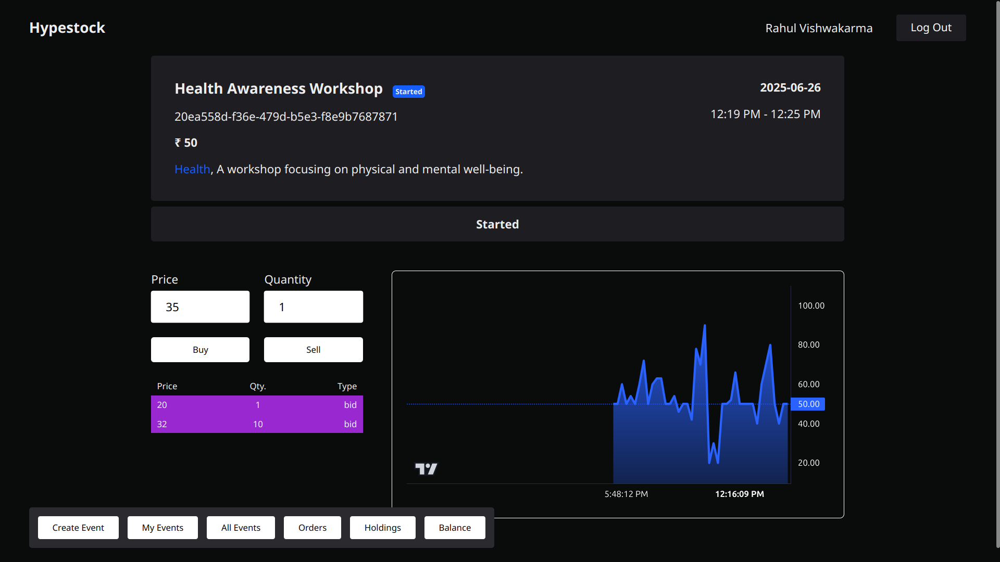
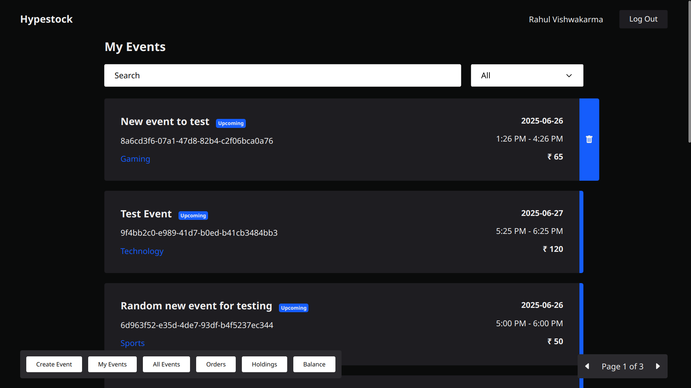
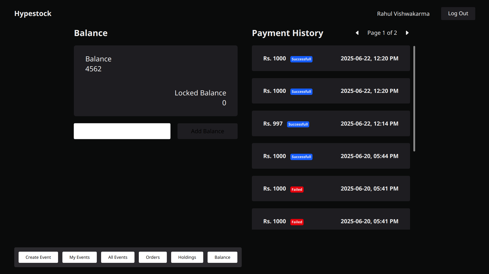
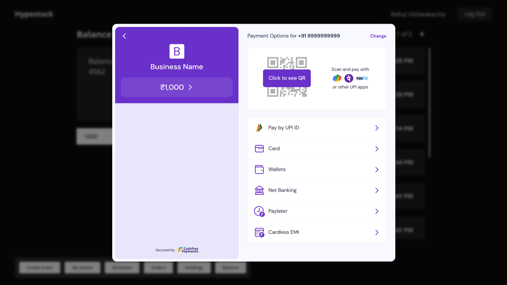
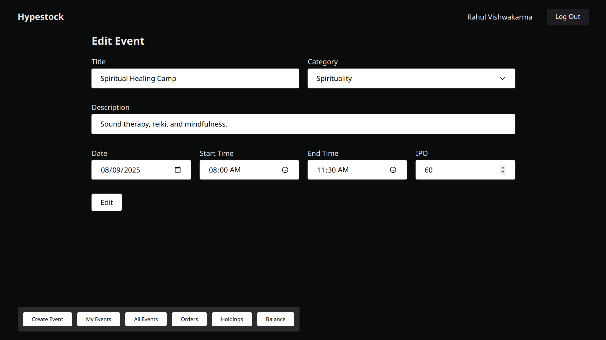

# 📈 Hypestock

**Hypestock** is a real-time, event-based virtual stock trading platform where users can buy and sell stocks tied to real-world events. Designed to simulate dynamic market behavior around events, the platform combines interactive trading, live updates, and scalable backend logic.

---

## 🚀 Features

- 🔄 **Real-Time Order Matching** using **Socket.IO**
- 📊 **Interactive Price Charts** with **Lightweight Charts**
- 💸 **Secure Payment Integration**
- 🧮 **Platform Profit System** based on Bid/Ask Spread
- ⏰ **Cron Jobs** for Event Lifecycle (Start, End, Settlement)
- 🗂️ **Role-Based Authentication** using **Auth0**
- 🧠 **Smart Caching** with **Redis** for Events & Orders
- ✅ **Schema Validation** via **Zod**
- 🧾 **Type-Safe DB Access** using **Prisma**
- 📬 **Real-Time Holdings Updates** and Order Book
- 📅 **Event Creation System** with Start/End Times

---

## 🛠️ Tech Stack

**Frontend:**  
`Angular v19`, `RxJS`, `NgRx`, `HTML5`, `CSS3`, `TypeScript`, `Lightweight Charts`, `Socket.IO Client`

**Backend:**  
`Node.js (Express)`, `Prisma ORM`, `Zod`, `Redis`, `Socket.IO`, `PostgreSQL (Supabase)`, `Auth0`, `Cron Jobs`

**DevOps & Hosting:**  
`AWS EC2`, `Supabase`, `CI/CD via GitHub Actions`

---

## 📸 Screenshots

